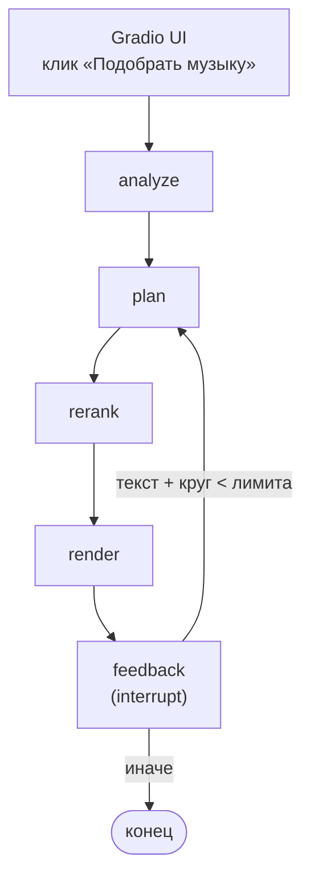

# sound_loops

Агент, который подбирает музыку к немому короткому видео-лупу: смотрит на
кадры, сам формулирует текстовые запросы к библиотеке треков, ищет и
переранжирует кандидатов, собирает три варианта превью — а если ни один не
понравился, принимает текстовую обратную связь («мрачнее», «без вокала») и
подбирает заново. Поверх — веб-интерфейс на [Gradio](https://www.gradio.app/).

```bash
make ui   # http://localhost:7860
```

## Архитектура: граф LangGraph

Подбор музыки — граф [LangGraph](https://langchain-ai.github.io/langgraph/)
с явным состоянием: поиск музыки — инструмент, который модель вызывает сама, а не жёстко зашитый шаг.



- **analyze** — кадры лупа + алгоритмическая оценка движения (разница
  соседних кадров, не VLM) → закрытые категории `setting`/`mood` от VLM.
  Результат кешируется (`video_analyses`) по `(loop_id, модель, версия
  промпта)`, на видео считается один раз.
- **plan** ([agent_planner.py](src/sound_loops/agent_planner.py)) — модель
  сама вызывает инструмент `search_music` (текстовый запрос + опционально
  диапазон темпа и вокал), пока не наберёт 3 разных запроса. Резервный
  путь, если модель дважды подряд не вызвала инструмент: не разбор
  свободного текста её ответа (парсинг хрупкий), а переиспользование уже
  проверенного `compose_music_query` из более ранней итерации.
- **rerank** — для каждого из 3 пулов кандидатов модель выбирает один трек
  и коротко объясняет выбор, с дедупликацией между пулами одного круга.
- **render** — длительность превью задаёт трек (~30с), а не луп: трек
  играет с начала, луп повторяется целое число раз, пока не заполнит его.
  Видео повторяется через `ffmpeg -stream_loop`, без перекодирования.
- **feedback** — штатный `interrupt()` LangGraph: граф останавливается
  между вызовами `graph.invoke()` и ждёт текст пользователя, состояние
  живёт в Postgres-чекпойнтере (`langgraph-checkpoint-postgres`), сессия
  переживает перезапуск процесса. Текст обратной связи не разбирается
  отдельным узлом — складывается в состояние как есть и уходит в `plan`
  вместе с историей уже отвергнутых треков.

Круг ограничен `AGENT_MAX_ROUNDS` (по умолчанию 3). Под каждым превью в интерфейсе — оценка
хорошо/нейтрально/плохо; «плохо» постоянно исключает трек из поиска
**для этого же лупа**.

## Модели: что и почему

**[CLAP](https://github.com/LAION-AI/CLAP)** (`laion/larger_clap_general`,
через `transformers.ClapModel`/`ClapProcessor`,
раскладывает текст и аудио в одно 512-мерное пространство: текстовый запрос
сравнивается напрямую с треком через косинусную близость (`pgvector`,
HNSW). Тем же чекпоинтом посчитаны и zero-shot теги треков (контрастные
фразы по жанру/настроению/вокалу) — читаемые атрибуты для фильтра и модели-
переранжировщика, не истина в последней инстанции.

**VLM — `qwen3-vl:4b-instruct` через [Ollama](https://ollama.com/)**, одна
модель на всё: понимание сцены (`analyze`) и вызов инструментов агентом
(`plan`). Среди vision-моделей в Ollama это скорее исключение — большинство
на запрос со списком инструментов отвечают ошибкой "not supported", а
`qwen3-vl` совмещает зрение и tool calling в одной модели. Та же
модель отвечает и на чисто текстовые запросы (резервный путь `plan`,
композиция запроса). В эвалах оба вызова модели всегда идут с
`temperature=0`.

**Гибридный поиск и переранжирование** — не основной рычаг качества,
подробности и почему в README ниже: атрибуты трека (темп через
`librosa.beat.beat_track` с коррекцией октавной ошибки, zero-shot теги
CLAP) дают SQL-фильтр с лестницей послаблений, поверх — векторное
ранжирование и опциональное переранжирование топ-3 моделью с объяснением.
Текущая рекомендация — оба выключены по умолчанию (см. «Эвалы» ниже,
почему).

## Эвалы

Датасет — `evals/dataset.json`,
30 лупов, размечены вручную: `setting`/`mood` в тех же закрытых категориях, что у шага
`analyze`, и 1–3 `good_tracks`, найденных через `make search` и проверенных
на слух — то есть заранее известные «правильные ответы» для каждого лупа.

```bash
make eval-run                                 # метрики по всему набору
make eval-compare A=evals/runs/x.json B=evals/runs/y.json
make blind-eval                               # слепое A/B против случайного baseline
```

### Что означают метрики

Первые две проверяют шаг `analyze` (понимание сцены), остальные — шаги
поиска/подбора трека. Везде «доля лупов» — это число от 0 до 1 по всем 30
лупам датасета.

- **setting accuracy** — доля лупов, где категория `setting`, которую
  предсказала VLM, совпала с разметкой. Выше — лучше, 1.0 = угадано всегда.
- **mood overlap (mean)** — среднее по лупам пересечение предсказанных и
  размеченных `mood` (Jaccard: «сколько общих меток» / «сколько меток
  всего»), тоже от 0 до 1. Выше — лучше.
- **hit@1 / hit@5** — доля лупов, где хотя бы один из размеченных
  `good_tracks` оказался среди топ-1 / топ-5 результатов поиска музыки.
  Выше — лучше; hit@1 строже — это по сути «модель с первой попытки
  предложила подходящий трек».
- **mean best rank** — на каком месте в выдаче поиска оказался лучший из
  `good_tracks`, в среднем по лупам, где он вообще нашёлся среди первых
  `eval_search_depth` (500) результатов. Чем меньше число, тем лучше
  (1 — трек первым в выдаче). Лупы, где ни один `good_track` не попал в
  топ-500, в это среднее не входят — их число указано рядом как
  «не найдено в топ-500: k/30».
- **mean_penalized_rank** — та же идея, но честнее для сравнения разных
  конфигураций: лупы «не найдено» не выбрасываются из среднего, а
  получают штраф, равный `eval_search_depth` (500), как будто трек нашёлся
  на самом дне выдачи. Без этого штрафа конфигурация, которая чаще вообще
  проваливает поиск, могла бы показывать средний ранг лучше — просто за
  счёт того, что выбрасывает из среднего самые сложные случаи. Тоже
  «меньше — лучше», и именно эта метрика используется ниже для сравнения
  конфигураций между собой.

### Baseline

30 лупов, `evals/runs/20260920T125514_56840b8.json`:

| метрика | значение |
|---|---|
| setting accuracy | 0.53 |
| mood overlap (mean) | 0.27 |
| hit@1 / hit@5 | 0.07 / 0.10 |
| mean best rank | 120.6 (не найдено в топ-500: 11/30) |

Т.е. VLM угадывает `setting` в 53% лупов, а первый релевантный трек
подбору музыки удаётся поставить на топ-1 только в 7% случаев — качество
поиска, а не понимания сцены, здесь узкое место (подробнее — «Известные
ограничения» ниже).

### Сравнение конфигураций гибридного поиска

30 лупов, `eval_search_depth=500`, метрика — `mean_penalized_rank` (меньше
— лучше, см. объяснение выше); `evals/runs/20260920T131920_56840b8.json` —
фильтры, `20260920T132103_56840b8.json` — фильтры + реранк, baseline без
фильтров — прогон выше:

| конфигурация | penalized rank | не найдено в топ-500 |
|---|---|---|
| **без фильтров** | **259.7** | 11/30 |
| фильтры | 270.3 | 13/30 |
| фильтры + реранк | 270.3 | 13/30 |

Фильтры и реранк не улучшают retrieval на текущем промпте (penalized rank
не ниже, а число «не найдено» даже выросло) — отсюда рекомендация не
включать `--filters`/`--rerank` по умолчанию. Реранк архитектурно оправдан
(читаемые объяснения, чистый RAG), но пользы на этом наборе не показал.

### Надёжность вызова инструмента агентом

30 лупов, `eval-run --agent`, `evals/runs/20260920T132553_56840b8.json`:
**90 из 90 вызовов (100%) — модель сама вызвала `search_music` все три
раза на каждом лупе, резервный путь ни разу не понадобился.** `hit@k` для
агента считается по объединению кандидатов всех 3 запросов (трек засчитан,
если попал в топ-k хотя бы одного из трёх поисков):

| конфигурация | mean penalized rank | не найдено в топ-500 |
|---|---|---|
| лучшая из гибридного поиска (новый промпт B, без фильтров) | 259.7 | 11/30 |
| **агент, объединение 3 запросов** | 370.2 | 10/30 |

Агент почти не выигрывает по доле «не найдено» (10/30 против 11/30), но
проигрывает по среднему рангу (370.2 против 259.7) — три более узких
запроса реже промахиваются совсем, но и реже подряд находят несколько
релевантных треков сразу, которые чаще есть в выдаче одного точного
запроса. Дальше — почему этот вывод не окончательный.

На текущей разметке агент проигрывает по среднему рангу и почти не
выигрывает по доле «не найдено» (10/30 против 11/30) — расширенные
`good_tracks` сняли эффект, ради которого диверсификация запросов раньше выглядела сильно
выгоднее: разброс по 3 узким запросам реже промахивается совсем, но и
реже подряд находит несколько релевантных треков сразу, которые теперь
чаще есть в выдаче одного точного запроса. Не свидетельство «агент хуже»
— свидетельство, что вывод «диверсификация выгодна» был чувствителен к
скудности старой разметки; надо перепроверять на большем датасете.

## Известные ограничения

- Датасет — 30 лупов, размечены одним человеком; разница в пару процентов
  между прогонами ничего не значит, метрики ловят только заметные сдвиги.
- `hit@1`/`hit@5` низкие во всех конфигурациях (0.00–0.10) — известное
  ограничение этого этапа (см. «Эвалы» выше), не баг измерения.
- Фильтры и реранк не дают измеримой пользы на текущем промпте —
  включены только по явному флагу, не по умолчанию.
- Лестница послаблений фильтра почти не нагружена: на `eval_search_depth=500`
  почти никогда не срабатывает, на боевой глубине сработала 1 раз из 30 в
  отдельной проверке.


## Установка и запуск

**Нужно**: Python 3.12, [uv](https://docs.astral.sh/uv/), ffmpeg/ffprobe,
локальный PostgreSQL с расширением [pgvector](https://github.com/pgvector/pgvector),
[Ollama](https://ollama.com/) с моделью `qwen3-vl:4b-instruct`.

```bash
brew install ffmpeg ollama
brew services start ollama
ollama pull qwen3-vl:4b-instruct   # ~3.3ГиБ

# pgvector, если готового бинарного пакета под вашу версию Postgres нет в brew:
git clone --depth 1 --branch v0.8.0 https://github.com/pgvector/pgvector.git
cd pgvector
make PG_CONFIG=$(brew --prefix postgresql@15)/bin/pg_config
make install PG_CONFIG=$(brew --prefix postgresql@15)/bin/pg_config

make sync                # зависимости проекта
cp .env.example .env     # строка подключения к уже работающему Postgres
make init-db             # база + миграции (yoyo, идемпотентно)
```


**Данные** (`data/` в `.gitignore`, ничего оттуда не коммитится):

- `data/loops/*.mp4` — немые видео-лупы 3–11с, готовятся вручную вне
  проекта.
- `data/raw/fma_small/NNN/NNNNNN.mp3` + `data/raw/fma_metadata/tracks.csv`
  — подмножество [FMA](https://github.com/mdeff/fma) (для старта хватит
  200–300 mp3, оба архива поддерживают HTTP Range — распаковывать всё
  7+ ГиБ не обязательно).

**Команды** (полный список — `Makefile`; каждая цель — обёртка над
`uv run sound-loops ...`):

```bash
make ingest-loops                          # заполнить loops из data/loops
make ingest-tracks                         # заполнить tracks из data/raw
make index                                 # CLAP-эмбеддинги треков
make tag-tracks                            # темп + zero-shot теги (нужен index)
make search QUERY="sad piano"              # топ-5 по текстовому описанию
make match-loop LOOP=data/loops/x.mp4      # analyze+match для одного лупа
make ui                                    # веб-интерфейс агента
make eval-run                              # метрики по evals/dataset.json
```

## Тесты

```bash
make test
make lint
```

Тесты используют настоящий Postgres (отдельная `_test`-база, создаётся
автоматически) и синтетические ffmpeg-lavfi медиа вместо реального
датасета — реальные лупы/треки для тестов не нужны.

## Дальше

- Генерировать музыку под описание.
- Делать склейки видео/аудио в "идеальный" луп, под бит и тд.
